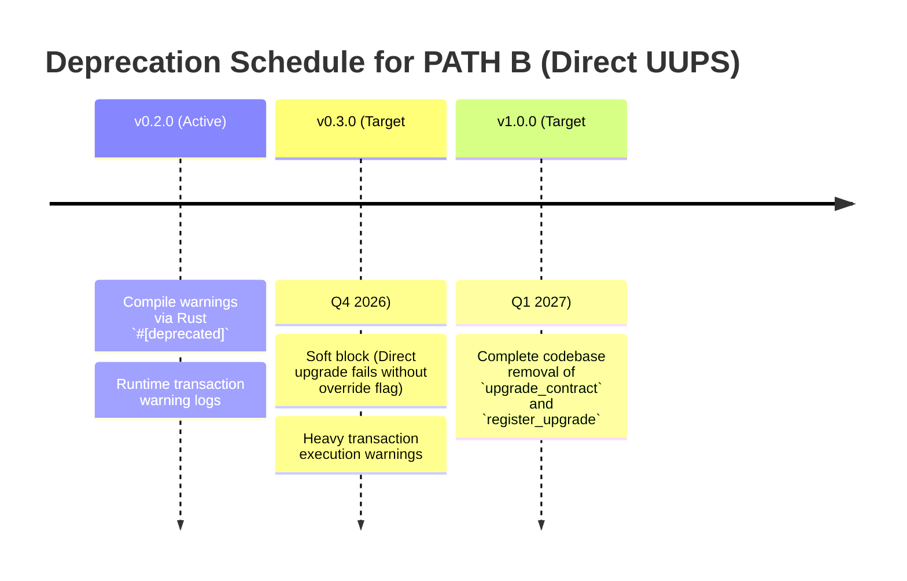

# Deprecation Timeline & Migration Guide

**Version**: 1.0  
**Date**: August 2026  
**Status**: Deprecated  

---

## Overview

The `UpgradeRegistryContract` provides two paths for upgrading tracked contracts in the ecosystem:

1. **PATH A — Two-Step (RECOMMENDED)**:
   - Step 1: `schedule_upgrade(contract_name, new_version, changelog_hash)` (Starts timelock delay)
   - Step 2: `execute_pending_upgrade(contract_name)` (Applies the upgrade after timelock delay)
2. **PATH B — Direct UUPS (DEPRECATED)**:
   - Single-step: `upgrade_contract` (Direct UUPS upgrade using previous timelock timestamp rules)
   - Tracking helper: `register_upgrade` (Manual external upgrade registration)

To align with modern security practices, prevent race conditions, and guarantee audit logs, **PATH B (Direct UUPS Upgrade) is deprecated** and scheduled for removal.

---

## Deprecation Timeline

The transition away from PATH B is divided into three phases:



### Phase 1: Compile-Time & Runtime Warnings (v0.2.0 - Active)
- **Compile-time**: The functions `upgrade_contract` and `register_upgrade` are decorated with Rust's `#[deprecated]` attribute. Client bindings and rust contract code referencing them will trigger compiler warnings.
- **Runtime**: Invoking these functions logs a prominent warning to the ledger logs indicating the deprecation and target removal version.

### Phase 2: Sunset / Soft Block (v0.3.0 - Target Q4 2026)
- The functions remain in the ABI but will revert transactions unless a specific emergency override parameter is supplied or a configuration flag is toggled.
- Callers are heavily pushed to transition implementation deployment scripts to the two-step flow (PATH A).

### Phase 3: Code Removal (v1.0.0 - Target Q1 2027)
- The functions `upgrade_contract` and `register_upgrade` will be deleted from the `UpgradeRegistryContract` interface.
- Supported upgrade logic will strictly use the two-step flow (`schedule_upgrade` + `execute_pending_upgrade`).

---

## Migration Guide for Clients

All automation scripts, CI/CD pipelines, and multisig proposal tools must migrate from calling `upgrade_contract` / `register_upgrade` to the two-step upgrade mechanism.

### Replacing `upgrade_contract` with PATH A

#### Legacy Flow (PATH B)
```bash
soroban contract invoke \
  --id <UPGRADE_REGISTRY_ID> \
  --source admin \
  --network mainnet \
  -- \
  upgrade_contract \
  --new_wasm_hash <WASM_HASH> \
  --contract_name <CONTRACT_SYMBOL> \
  --new_version <NEW_VERSION> \
  --changelog_hash <CHANGELOG_HASH> \
  --approvers '["<SIGNER_A>", "<SIGNER_B>"]'
```

#### New Two-Step Flow (PATH A)

**Step 1: Schedule the upgrade**
```bash
soroban contract invoke \
  --id <UPGRADE_REGISTRY_ID> \
  --source admin \
  --network mainnet \
  -- \
  schedule_upgrade \
  --new_wasm_hash <WASM_HASH> \
  --contract_name <CONTRACT_SYMBOL> \
  --new_version <NEW_VERSION> \
  --changelog_hash <CHANGELOG_HASH> \
  --approvers '["<SIGNER_A>", "<SIGNER_B>"]'
```
*Note: This starts the timelock delay (configured by `set_upgrade_delay`). You must wait for the timelock to expire.*

**Step 2: Execute the upgrade**
After the upgrade delay has elapsed (e.g. 48 hours), execute the pending upgrade:
```bash
soroban contract invoke \
  --id <UPGRADE_REGISTRY_ID> \
  --source admin \
  --network mainnet \
  -- \
  execute_pending_upgrade \
  --approvers '["<SIGNER_A>", "<SIGNER_B>"]'
```

---

## Code Removal Plan

The following codebase components will be affected in the `v1.0.0` release:

1. **Functions to be deleted** from `UpgradeRegistryContract` in [lib.rs](file:///home/adedayo/devzone/projects/web3/MentorsMind-Contract/contracts/upgrade_registry/src/lib.rs):
   - `pub fn upgrade_contract(...)`
   - `pub fn register_upgrade(...)`
2. **Test suites to be removed or refactored** in [tests/upgrade_safety_tests.rs](file:///home/adedayo/devzone/projects/web3/MentorsMind-Contract/tests/upgrade_safety_tests.rs):
   - `fn test_upgrade_contract_rejects_downgrade()`
   - `fn test_upgrade_contract_rejects_same_version()`
   - `fn test_upgrade_contract_succeeds_with_higher_version()`
   - `fn test_upgrade_contract_before_timelock_fails()`
   - `fn test_upgrade_contract_timelock_elapsed()`
3. **Benchmarks to be removed** in [benchmarks/src/suites/upgrade_registry.rs](file:///home/adedayo/devzone/projects/web3/MentorsMind-Contract/benchmarks/src/suites/upgrade_registry.rs):
   - Benchmark for `upgrade_contract` entry point
   - Benchmark for `register_upgrade` entry point
